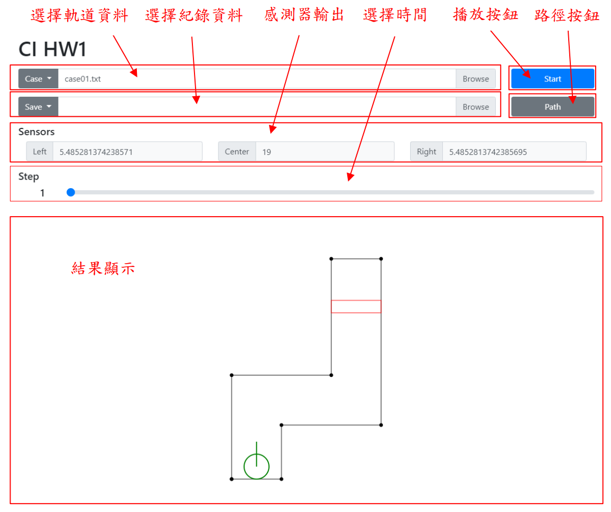
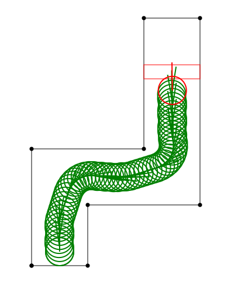

# 自走車模擬
中央大學 CE6126 計算型智慧 作業一

以模糊系統實現自走車模擬

*You can install browser extensions like [this](https://chrome.google.com/webstore/detail/mathjax-plugin-for-github/ioemnmodlmafdkllaclgeombjnmnbima) to render math equations.

# 使用方法
1. 選擇軌道資料: 以下拉選單選擇預置軌道資料，或直接選擇檔案。
2. 選擇紀錄資料: 以下拉選單選擇預置紀錄資料，或直接選擇檔案。
3. 按下 Start 按鈕開始播放自走車移動軌跡。
4. 按下 Path 按鈕顯示自走車移動軌跡。
5. 拖動 Step 滑條顯示每一時刻的自走車位置。

# 程式說明
## 碰撞檢測
+ 邊緣碰撞檢測

    計算自走車圓心至每一邊緣延伸線的垂足點，若垂足點在邊緣線段bounding box 中，則計算其與自走車圓心的距離。若最小垂足點距離小於或等於車體半徑，則發生碰撞。

+ 轉角碰撞檢測
   
   若任意轉角與自走車圓心距離小於或等於車體半徑，則發生碰撞。

## 距離檢測
計算長度為 1000 的感測器線段與每一邊緣線段的交點(若有相交)，自走車圓心至各交點的最小距離減去車體半徑即為感測器輸出。

## 模糊系統
+ 模糊化機構採用梯形歸屬函數。
+ 模糊規則庫採用語意式模糊規則。
+ 模糊推論引擎採用最大-最小合成。
+ 去模糊化機構採用最大平均法(每 1 單位取樣一次)。

# 模糊規則設計
## 歸屬函數
1. Center is close (中央感測器接近)
$$
\mu_{cc}(x)=
\begin{cases}
1, &x\leq0 \\
-\frac{x}{5}+1, &0<x\leq5 \\
0, &x>5
\end{cases}
$$
1. Left is close (左方感測器接近)
$$
\mu_{lc}(x)=
\begin{cases}
1, &x\leq0 \\
-\frac{x}{9}+1, &0<x\leq9 \\
0, &x>9
\end{cases}
$$
3. Right is close (右方感測器接近)
$$
\mu_{rc}(x)=
\begin{cases}
1, &x\leq0 \\
-\frac{x}{9}+1, &0<x\leq9 \\
0, &x>9
\end{cases}
$$
4. Handle is right (方向盤為右)
$$
\mu_{hr}(x)=
\begin{cases}
0, &x\leq0 \\
\frac{x}{40}, &0<x\leq40 \\
1, &x>40
\end{cases}
$$
5. Handle is left (方向盤為左)
$$
\mu_{hr}(x)=
\begin{cases}
0, &x\geq0 \\
-\frac{x}{40}, &-40\leq x<0 \\
1, &x<-40
\end{cases}
$$
## 模糊規則
1. If center is close then handle is right

    若中央感測器接近，則方向盤為右。
2. If left is close then handle is right

    若左方感測器接近，則方向盤為右。
3. If right is close then handle is left

    若右方感測器接近，則方向盤為左。
## 輸出
令 $𝑐$ 為中央感測器輸出，$l$ 為左方感測器輸出，$r$ 為右方感測器輸出，則推論後得到的模糊集合為：
$$
\mu(𝑦) = max(min(\mu_{cc}(c), \mu_{hr}(y)), min(\mu_{lc}(l), \mu_{hr}(y)), min(\mu_{rc}(r), \mu_{hl}(y))))
$$
令 $Y$ 為對 $\mu(𝑦)$ 的取樣值集合，則經去模糊化得到的輸出為：
$$
y^* = \frac{1}{N}\sum^N_{j=1}y_j
$$
其中 $\mu(y_j) = \underset{y \in Y}{max}\mu(y), j=1,\cdots,N$

# 實驗結果

+ case01輸出結果